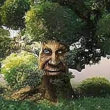

## Trees (Documentation from RStudio)
<r>

#### Diameter, Height and Volume for Black Cherry Trees
### Description:
This data set provides measurements of the diameter, height and volume of timber in 31 felled black cherry trees. Note that the diameter (in inches) is erroneously labelled Girth in the data. It is measured at 4 ft 6 in above the ground.

#### Usage:
trees
#### Format:
A data frame with 31 observations on 3 variables.

* [,1]Girth	numeric	Tree diameter (rather than girth, actually) in inches
* [,2]Height	numeric	Height in ft
* [,3]Volume	numeric	Volume of timber in cubic ft
#### Source:
* Meyer, H. A. (1953) Forest Mensuration. Penns Valley Publishers, Inc.

* Ryan, T. A., Joiner, B. L. and Ryan, B. F. (1976) The Minitab Student Handbook. Duxbury Press.

#### References
* Atkinson, A. C. (1985) Plots, Transformations and Regression. Oxford University Press.
